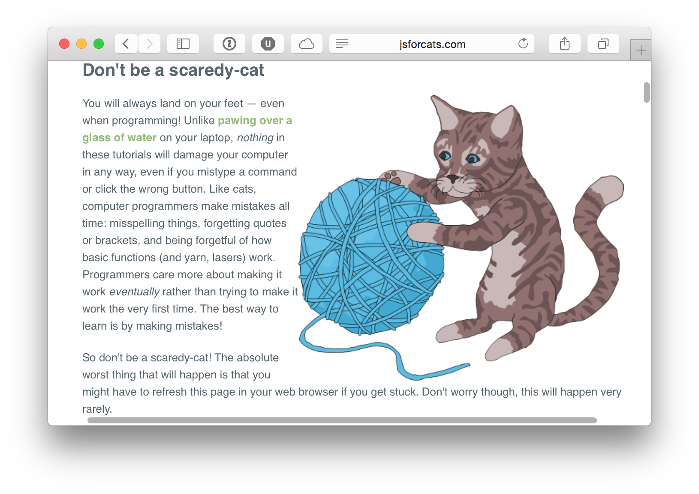
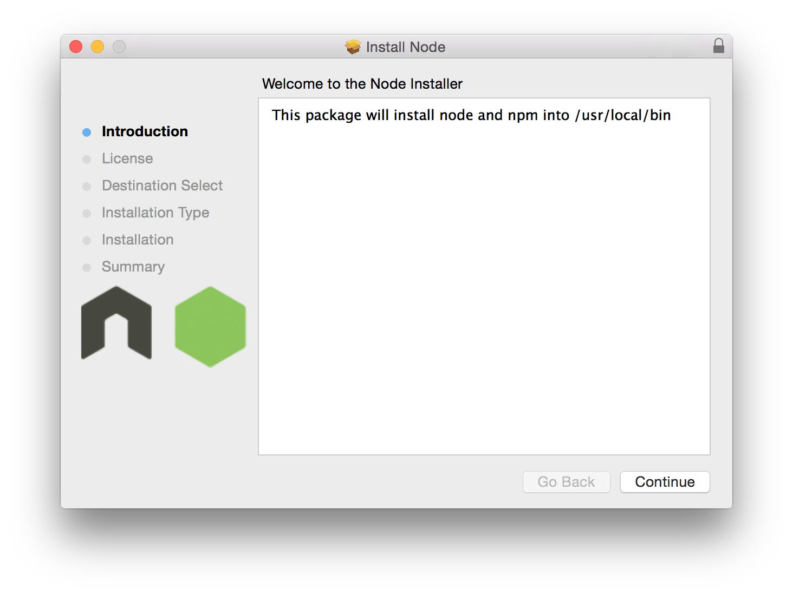
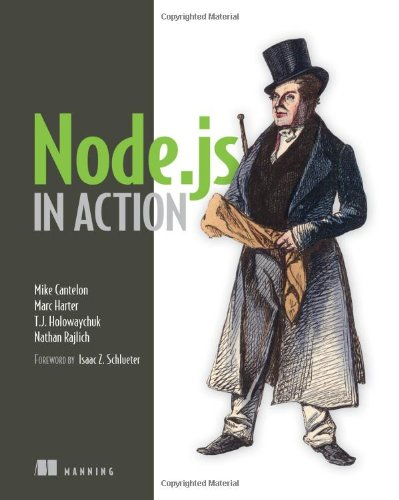
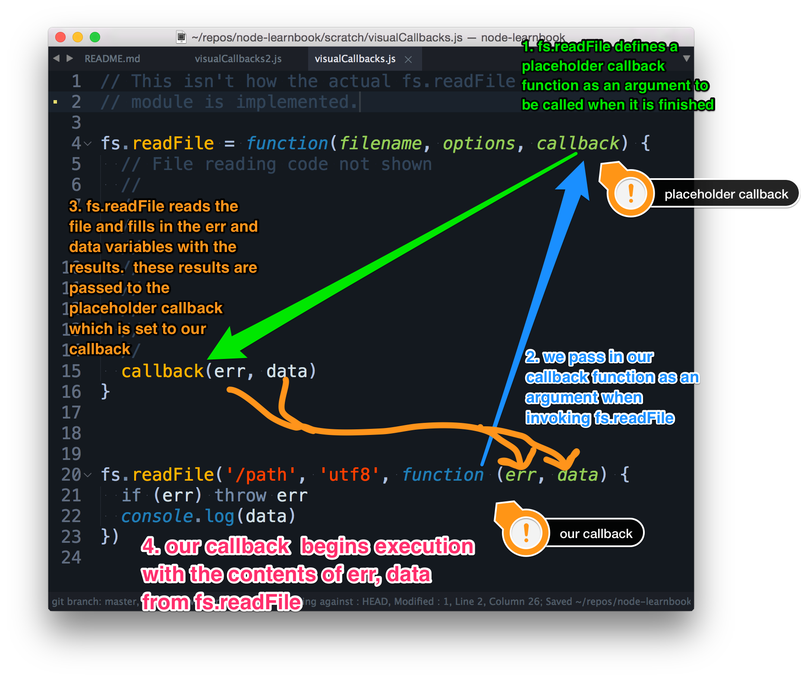

# node-learnbook

Lets learn node the node way! 🐪 🙈


It's uncertain where this trek will take us, but we will try to strike a balance between instructional material, history, and philosophies on node, javascript, software, programming, engineering, communication, and tooling.

We may also cover a few other useful places to learn cool tools and skills like:

- html
- css
- git
- irc
- linux/unix (aka \*nix)
- app deployment
- people skills

## TOC

<!-- TOC depth:6 withLinks:1 updateOnSave:1 -->
- [node-learnbook](#node-learnbook)
	- [TOC](#toc)
	- [Required Provisions](#required-provisions)
	- [How long is this adventure going to last?](#how-long-is-this-adventure-going-to-last)
- [Getting started.](#getting-started)
	- [[Javascript for Cats](http://jsforcats.com)](#javascript-for-catshttpjsforcatscom)
	- [[Codecademy](http://www.codecademy.com/en/tracks/javascript)](#codecademyhttpwwwcodecademycomentracksjavascript)
	- [[nodeschool.io: javascripting](https://github.com/sethvincent/javascripting)](#nodeschoolio-javascriptinghttpsgithubcomsethvincentjavascripting)
- [What is javascript?](#what-is-javascript)
- [What is node?](#what-is-node)
	- [More links on understanding what node is:](#more-links-on-understanding-what-node-is)
- [How to get node](#how-to-get-node)
	- [OSX](#osx)
	- [Linux](#linux)
	- [Windows](#windows)
- [How to know node](#how-to-know-node)
	- [[The Art of Node](https://github.com/maxogden/art-of-node#the-art-of-node)](#the-art-of-nodehttpsgithubcommaxogdenart-of-nodethe-art-of-node)
	- [[Node.js in Action](http://www.manning.com/cantelon/)](#nodejs-in-actionhttpwwwmanningcomcantelon)
	- [[Nodeschool.io](http://nodeschool.io/) Core](#nodeschooliohttpnodeschoolio-core)
		- [[Node School Core](http://nodeschool.io/#workshopper-list)](#node-school-corehttpnodeschoolioworkshopper-list)
- [Callbacks visualized](#callbacks-visualized)
	- [Callback you later](#callback-you-later)
- [Javascript the hard parts](#javascript-the-hard-parts)
	- [[Nodeschool.io](http://nodeschool.io/) Core Redux](#nodeschooliohttpnodeschoolio-core-redux)
	- [[Effective Javascript](http://effectivejs.com)](#effective-javascripthttpeffectivejscom)
	- [[Eloquent Javascript](http://eloquentjavascript.net)](#eloquent-javascripthttpeloquentjavascriptnet)
	- [[Javascript: The Good Parts]()](#javascript-the-good-parts)
	- [More hard part links](#more-hard-part-links)
- [... [WIP]](#-wip)
- [`npm` stuffs](#npm-stuffs)
- [Semver](#semver)
- [Node in the browser?](#node-in-the-browser)
- [Event Emitters](#event-emitters)
- [👻👻 Inheritance, Composition, and the Prototype Chain](#-inheritance-composition-and-the-prototype-chain)
- [Write your tests, eat your greens](#write-your-tests-eat-your-greens)
- [Whats the deal with Streams?](#whats-the-deal-with-streams)
- [Node.js and io.js Anthropology](#nodejs-and-iojs-anthropology)
- [Tools to write Node](#tools-to-write-node)
- [Spellcheck for Javascript](#spellcheck-for-javascript)
- [All the badges](#all-the-badges)
- [Hex Stickers](#hex-stickers)
- [An adventure of your own](#an-adventure-of-your-own)
- [JS is the worlds polyglot assembly language now](#js-is-the-worlds-polyglot-assembly-language-now)
- [ES6 and Beyond](#es6-and-beyond)
- [Frameworks](#frameworks)
- [Haters gonna hate](#haters-gonna-hate)
- [html + css](#html-css)
- [Community](#community)
- [Mastering git](#mastering-git)
- [Electron?](#electron)
- [Cool Cats writing Cool Modules](#cool-cats-writing-cool-modules)
	- [School of Substack](#school-of-substack)
- [People to watch](#people-to-watch)
- [Link Dump](#link-dump)
<!-- /TOC -->

## Required Provisions

* A computer 💻 (hopefully running a flavor of unix)
  * OS X will be easiest to use
  * Linux and windows are a bit more difficult
* Internet and a browser 📞
* some time and interest 🙇

We will be acquiring items and tools along the way.

## How long is this adventure going to last?

Getting through all the material is going to take time.  Visit the places that seem most interesting, and don't get stuck on something you find boring or overwhelming.  Programming is [more fun and effective as a hobby](https://twitter.com/substack/status/586438480164589568) and you will learn more if you treat it that way.

Do take breaks and try to build something interesting.  Even if you fail, you will learn something.  Publishing your experiments feels good and creates breadcrumbs for others to learn from.

Don't go at it alone.  Get in touch with your local javascript and node community and make friends.  Don't live near anyone?


There is a vibrant and active community that is on-line at all hours of the day so you can remain isolated but still be connected with thousands of people.  Skip ahead to [#community](https://github.com/bcomnes/node-learnbook#community) to find your way into the node community.

# Getting started.

Before we get started, we need to be somewhat prepared to face what lies ahead.  In order to communicate with the local populous you need to learn how to speak javascript

## [Javascript for Cats](http://jsforcats.com)
If your a cat, like to have fun or learn like a cat, this will teach you the basics of javascript.

[](http://jsforcats.com)

## [Codecademy](http://www.codecademy.com/en/tracks/javascript)
If you tend to be a bit more serious, Codecademy's Javascript is also a good place to start.  Don't feel bad if you get bored and don't finish.  It's picking up the syntax that counts.

[](http://www.codecademy.com/en/tracks/javascript)

## [nodeschool.io: javascripting](https://github.com/sethvincent/javascripting)

We will revisit [nodeschool.io](http://nodeschool.io/) in the near future, but for now the `javascripting` nodeschool adventure is a good place to start learning javascript.  It may be a bit steep for absolute beginners.  Read through the [`get going`](http://nodeschool.io/#get-going) section to get up and running.

For those who know their way around `npm` already:

```sh
npm install -g javascripting

```

[](https://github.com/sethvincent/javascripting)

# What is javascript?

Javascript is the programming language that your web browser comes with, but these days its becoming a lot more.  Its pretty okay.  Its not the best language and has a lot of warts, but it gets a lot right, and you don't really have a choice about using it or not (although this is changing, for better or for worse).  You should shouldn't skip javascript though.

[Douglas Crockford](http://www.crockford.com) gave a good presentation that effectivly answers the question: "What is Javascript?" in his 2012 "Javascript: Your New Overlord" presentation:

[](https://www.youtube.com/watch?v=Trurfqh_6fQ)

[Javascript: Your New Overlord](https://www.youtube.com/watch?v=Trurfqh_6fQ)

You should watch it!

# What is node?

Node was created by [Ryan Dahl](http://tinyclouds.org).  He has since pulled a [Mark Pilgrim](http://www.diveintomark.link) and [HTTP 410](http://en.wikipedia.org/wiki/Mark_Pilgrim#.22Disappearance.22_from_the_Internet)'d himself from the INTERNET, but occasionally will post interesting undocumented code projects to his [github](https://github.com/ry) or [post to the node mailing list](https://groups.google.com/forum/#!activity/nodejs/2JvBi5ikhDgJ).

The best way to understand what node is to listen to Ryan describe it himself.

[](https://www.youtube.com/watch?v=ztspvPYybIY)

[Ryan Dahl: Original Node.js presentation](https://www.youtube.com/watch?v=ztspvPYybIY)

[Ryan Dahl: Original Node.js presentation Slide Deck](doc/jsconf.pdf) (pdf)

[](https://www.youtube.com/watch?v=GhFrlX0LdFA)

[Ryan Dahl Talk - NodeConf Theatre 2012.ogv](https://www.youtube.com/watch?v=GhFrlX0LdFA)

[Ryan Dahl Talk NodeConf Theatre 2012 Slides](doc/nodeconf2012.pdf) (pdf)

### What is Node: The Links

- http://blog.webfaction.com/2008/12/a-little-holiday-present-10000-reqssec-with-nginx-2/
- http://www.kegel.com/c10k.html
- http://nodejs.org/about/

# How to get node

There are lots of ways to install node.  Lets visit some of the better ways of this contentious topic.

## OSX

<a href="https://jamesfriend.com.au/pce-js/"></a>

The only prerequisite to installing node is that you have a copy of [Xcode](https://itunes.apple.com/us/app/xcode/id497799835?mt=12).  This installs the OS X build toolchain.  This is a really complicated set of programs that let you build software from source.  Some node modues use `c` "native addons" which require that you have a `c` compiler on your computer.  Its free and the only place to get it is from App store (boooo).

<a href="https://itunes.apple.com/us/app/xcode/id497799835?mt=12"></a>

OSX Terminal.app is pretty great for everything you need to do (although historically it used to suck).  Just use OSX's terminal unless you have a reason not to.

<a href="https://en.wikipedia.org/wiki/Terminal_(OS_X)"></a>

There are two great options to install `node` on OSX: Homebrew and the Offical Installer.

- ### [Homebrew](http://brew.sh)

  <a href="http://brew.sh"></a>

  Homebrew is a lightweight package manager for OS X.  Homebrew:

    - downloads and installs Unix CLI programs from source code
    - keeps track of which programs you installed and at what version
    - updates your programs when updates are available
    - download non-npm programs and utilities

  Until npm has packages for all external dependencies, having `brew` installed can be really helpful.

  Visit the [Homebrew](http://brew.sh) website for the latest instructctions on how get `brew` installed.  Once you have homebrew installed installing node is as easy as running:

  ```sh
  $ brew install node
  ```

  To get new releases of node in the future download run:

  ```sh
  $ brew update
  $ brew upgrade node
  ```

  Easy.

  A quick brew `101` so that you know what you just did:

    - `/usr/local` is a special unix folder where 'userspace' (e.g. not managed by the OS) programs can be safely installed.
    - Homebrew turns `/usr/local` into a git repo
    - `brew` uses "Formula" written as simple ruby scripts to download, build and install programs to `/usr/local/Cellar`
    - The active version of a program installed by `brew` is symlinked to `/usr/local/{bin,lib,...}`
    - `brew update` updates the `/usr/local` repo so that you have the latest 'Formula' available
    - All Formula can be built from source, but most have precompiled 'Bottles' (a.k.a. binaries) to save time and battery.
    - Old versions of programs can be installed by going back into the git history.

  A few more links discussing the merits of homebrew:

    - [to install node via Homebrew or not?](http://www.reddit.com/r/node/comments/37ui2u/to_install_node_via_homebrew_or_not/)


- ### [The official node installer `node-v*.pkg`](https://nodejs.org/download/)

  [](https://nodejs.org/download/)

  Easy.  You go to the node website, you [download the .pkg](https://nodejs.org/download/), and install it.  It installs to the same location that homebrew installs to: `/usr/local/bin`.


## Linux

Running Linux? (👍btw)


Don't just reach for your systems package manager.  Linux distributions almost universally ship painfully dated versions of node and npm (unless you are running something like [Arch Linux](https://www.archlinux.org)), and install them in ways that make them a total pain to use for the sake of 'stability'.  This sucks.

Luckily there is a comprensive resource on how to add software channels that have updated versions of node to common package mangers:

[Installing-Node.js-via-package-manager](https://github.com/joyent/node/wiki/Installing-Node.js-via-package-manager)

Don't sudo with npm!  (even -g).  Set up `npm` so that it works without sudo:

[Fixing npm permissions](https://docs.npmjs.com/getting-started/fixing-npm-permissions)

## Windows

> Windows is very important.  Just like PHP
-- [Ryan Dahl](https://youtu.be/jo_B4LTHi3I?t=56s)

[](http://nodejsreactions.tumblr.com/post/113606988159/corporates-attempting-to-woo-developers-jumping-on)

On windows, pretty much stick with the official installer:

[Official Installer](https://nodejs.org/download/)

There are a few package managers on windows which you are free to explore on your own time:

- [Chocolatey](https://chocolatey.org)
- [Scoop](https://github.com/lukesampson/scoop)

Windows support for node is pretty good.  Windows support for most npm modules is pretty bad.

You will also need to install a free version of Visual Studio for building modules that have native addons:

[Visual Studio Express](https://www.visualstudio.com/en-us/products/visual-studio-express-vs.aspx)

# How to know node

Now that we have seen a bit about the history and motivations behind node, lets actually visit the nessisary materials to acutally understand node.

## [The Art of Node](https://github.com/maxogden/art-of-node#the-art-of-node)

[](https://github.com/maxogden/art-of-node#the-art-of-node)

Written by the prolific [Max Ogden](http://maxogden.com),


[maxogden/art-of-node](https://github.com/maxogden/art-of-node#the-art-of-node) gives a thorough explanation of how node works, how to write node flavored javascript, callbacks and async programming, writing and using modules and how to be apart of the node/js community and do your best.  Its full of insight and clear reasoning, but when you are new to js and/or node, all of the subtleties can fly by pretty quickly.  **It's a short and easily digestible read, that you should probably read through a few times**.

## [Node.js in Action](http://www.manning.com/cantelon/)

[](http://www.manning.com/cantelon/)

([2nd Edition Coming Soon](http://www.manning.com/cantelon2/))

Written by a crew of early prolific node.js module developers, this book is *totally great* and *somewhat flawed*, and a bit dated at this point as well.  But for those that learn by example, *this is the book for you*.

It covers the basics of all the well known [Visionmedia](https://github.com/visionmedia)  modules (e.g. [express](http://expressjs.com), [mocha](http://mochajs.org), [connect](https://github.com/senchalabs/connect#readme), [jade](http://jade-lang.com), [ejs](http://www.embeddedjs.com) etc...).  You will learn to use all of these early node tools, including core node modules, async programming, testing, templating, CLI programs, and even node clustering from this book through the various included projects and examples.

Despite the fact that many of the modules discussed have changed their APIs, this is still a great reference and useful for learning node.

Unfortunately, this great collection of knowledge is tombed away in a book (*we should change that though*).  Get the book if you can.

**What this book does well:**

- Introduction to node, events async programming and flow control
- [socket.io](http://socket.io) examples
- npm modules: publishing and consuming
- Module resolution and loading (a.k.a. [require('foo')](https://nodejs.org/api/modules.html#modules_module_require_id))
- http
- ORMs and Databases
- Middleware and [Connect](https://github.com/senchalabs/connect)
- [Express](http://expressjs.com) photo hosting and microblogging app
- Testing (mostly Mocha)
- EJS and Jade templating
- Node application deployment
- System Calls
- Raw TCP/IP
- CLI Tools

Focus on the first and last 1/3 of the book, and don't sweat the middle 1/3rd (express/connect).

## [Nodeschool.io](http://nodeschool.io/) Core

<a href="http://nodeschool.io/"></a>

Nodeschool is a free resource that offers lessions and tutorials on tons of topcis, mostly relating to node and js.  The key is that the lessons are written for `node` and you install them with `npm` (usually).

### [Node School Core](http://nodeschool.io/#workshopper-list)

Start with [learnyounode](https://github.com/workshopper/learnyounode) which can be installed with

```sh
npm i -g learnyounode
```


(No, not [learnyouhaskell](http://learnyouahaskell.com/), that lives on a different planet)

After this, brush up on your `git` in `git-it`:

```sh
npm i -g git-it
```


Finally, wrap your head around `npm`


```sh
npm i -g how-to-npm
```


# Callbacks visualized

Callbacks are confusing at first, because you are writing functions that accept variables that seemingly come out of nowhere.

These variables come from the internals of the function accepting the callback function!

Before we get into it, remember:

- Async functions return immediately
- If your code needs the results of an async function, that code needs to live in the scope of the async functions callback.
- Code that invokes after the async function is invoked may finish sooner than the async function.
- [You can't `return` values from an async callback like you might think.](http://nodejsreactions.tumblr.com/post/56341420064/when-i-see-some-code-that-returns-a-value-from-an)

Lets take a look:



1. First, we define `fs.readFile`.  Typically you import this as a module (e.g. `var fs = require('fs')`), but for this example we want get an idea of what is going on internally.  The code to actually read files is omitted, but at the end of the function we see that the `callback` argument is invoked as a function (e.g. `callback(err, data)` where the `err` and `data` variables would be defined inside the function somewhere when reading the file.)

2. Next we invoke `fs.readFile` passing in a string containing the path to the file we wish to read, encoding options, and a callback function that accepts `err` and `data` arguments to match the arguments that the `callback` placeholder defines in step 1.  The file is read and the placeholder callback is replaced with our callback function that we passed as an argument.

3. After `fs.readFile` is done trying to read the file, it calls our callback function, passing to it `err` and `data` as arguments and our callback function then begins execution.  If there was no error when reading the file, `err` will be `undefined`/falsy so we can easily test for errors and handle them, or pass them along.

Lets clean it up a little.


We replace the anonymous function with a named function `logger` that we pass as the callback.  It's nearly the exact same thing as the first example, except now the function can be implemented independently from where we invoke fs.readFile.

Ok, so it's not always practical to go digging around the internals of a module to locate the callback signature (e.g. the arguments) that it expects of your callback.  This is where the module's `README.md` comes in.

How did we know `fs.readFile` expects a callback with `(err, data)` arguments?  We look it up!

**[node.js API docs: fs.readFile](https://nodejs.org/api/fs.html#fs_fs_readfile_filename_options_callback)**


Modules should come with a README.md with similar documentation.  If it doesn't have this, maybe look around for one that does.

We can write our own callback functions just as easily.


Here we write an async function that wraps the fs.readFile async function.

We write a function that accepts a callback as the last argument.  We do some asynchronous work inside of it, modify the output and then pass it into our callback.

Easy!

Well, in theory.  Callbacks take a bit of practice, but hopefully we can visualize callback flow and how variables and functions are passed around.

## Callback you later

You can read more about callbacks, but the best way to learn how to use them is to read and write lots of them!  While your doing that, peruse through these lovely links.

- [maxogden/art-of-node#callbacks](https://github.com/maxogden/art-of-node#callbacks)
- [callbackhell.com](http://callbackhell.com/)
- [Why callback hell can be your friend.](http://jondavidjohn.com/why-callback-hell-can-be-your-friend/)
- [Node In Action: 3.2 Asynchronous Programming Techniques](#nodejs-in-action) p.46
- [Eloquent Javascript: Http callbacks](http://eloquentjavascript.net/17_http.html#p_8Shcg3/WzI)

# Javascript the hard parts

Javascript is easy to learn, but hard to master.  It's a flawed language with lots of subtle pitfalls to be navigated.  These materials will help you master the more subtle and difficult aspects of the language.


##  [Nodeschool.io](http://nodeschool.io/) Core Redux

If you haven't already, finish up the core nodeschool workshops.  The last two are the most conceptually difficult:

`scope-chains-closures` teaches you all about scopes and closures!

```sh
npm i -g scope-chains-closures
```

`streams adventure` teaches you about streams.  This is a good place to start, but this adventure is dated and needs work.  Have you found a better streams adventure or tutorial?  Please open an issue with the links/info!

```sh
npm i -g streams-adventure
```

## [Effective Javascript](http://effectivejs.com)

[](http://effectivejs.com)

[Effecitve Javascript](http://effectivejs.com) is an excellent book focusing only on Javascritpt the Language.  It has answers and clarifications for the more confusing aspects of the languages, explains the prototype chain in a clear way, and covers the more advanced aspects of JS.  The only downside is the cost of the book, but is well worth it if you can afford it. A+

## [Eloquent Javascript](http://eloquentjavascript.net)

[](http://eloquentjavascript.net)

This is a free e-book (paper version is available too).  It seems to reside somewhere between [Effective Javascript](#effective-javascript) and [Node.JS in Action](#nodejs-in-action)

## [Javascript: The Good Parts]()

## More hard part links

- https://en.wikipedia.org/wiki/Event_loop
- https://en.wikipedia.org/wiki/Asynchronous_I/O

# ... [WIP]

Still pulling together the primordial ooze below.

# `npm` stuffs

- npm scripts
- package.json
- SPDX license expression
- http://blog.keithcirkel.co.uk/how-to-use-npm-as-a-build-tool/
- http://bocoup.com/weblog/a-facade-for-tooling-with-npm-scripts/

# Semver

- http://semver.org/
- http://semver-ftw.org/

# Node in the browser?

- [Browserify-handbook](https://github.com/substack/browserify-handbook)
- http://wzrd.in/
- https://github.com/thlorenz/browserify-shim#multi-shim-example-including-dependencies

# Event Emitters

I don't want to miss out.  Where do I go to learn these?

# 👻👻 Inheritance, Composition, and the Prototype Chain

AKA OO AKA Object Oriented.  Also prototypes.

# Write your tests, eat your greens

- https://github.com/substack/tape
- http://substack.net/how_I_write_tests_for_node_and_the_browser
- https://ci.testling.com/guide/tape
- https://github.com/brianleroux/browserify-tape-spec

# Whats the deal with Streams?

- [Streams handbook](https://github.com/substack/stream-handbook)
  > Streams can help to separate your concerns because they restrict the implementation surface area into a consistent interface that can be reused.

# Node.js and io.js Anthropology

- http://blog.izs.me/post/104685388058/io-js
- https://gist.github.com/maxogden/d96123138522c84cdb25
- http://tableflip.io:1234/
- https://github.com/iojs/io.js/issues/37
- https://nodesource.com/blog/was-this-trip-really-necessary
- https://twitter.com/rvagg/status/598605393636429825
- https://twitter.com/mikeal/status/598595967928008705
- https://github.com/nodejs/node
- https://www.youtube.com/watch?v=UbYiFLf7MpU
- https://github.com/nodejs/io.js/issues/1664#issuecomment-101828384

# Tools to write Node

# Spellcheck for Javascript

# All the badges

# Hex Stickers

- http://hexb.in/
- https://www.stickermule.com/
- https://hexi.pics/help_en

# An adventure of your own

Resources for teaching others and writing nodeschool adventures.

# JS is the worlds polyglot assembly language now

- http://bellard.org/jslinux/
- https://github.com/jashkenas/coffeescript/wiki/List-of-languages-that-compile-to-JS
-

# ES6 and Beyond

- https://medium.com/@brianleroux/es6-modules-amd-and-commonjs-c1acefbe6fc0
- http://espadrine.github.io/New-In-A-Spec/es6/
- https://en.wikipedia.org/wiki/ECMAScript

# Frameworks

- http://lebron.technology/
- http://hapijs.com/
- http://expressjs.com/
- https://github.com/Raynos/http-framework
- https://github.com/Raynos/mercury
- https://jshttp.github.io/

# Haters gonna hate

[](http://nodejsreactions.tumblr.com/post/74845429937/every-why-node-js-sucks-article-ever)

> Every “why Node.js sucks” article ever --[nodejs reactions](http://nodejsreactions.tumblr.com/post/74845429937/every-why-node-js-sucks-article-ever)

Node has its share of weak points.  Articles that hate on it generally miss these points.  A good way to learn about a tool is to analyze its criticism.  Does it have merit?  Is it correct?  Is the the stated issue as bad as the critic makes it out to be?

- [](https://www.youtube.com/watch?v=1e1zzna-dNw)

  [Biz of Tech: Node.JS Is Stupid And If You Use It So Are You](https://www.youtube.com/watch?v=1e1zzna-dNw)

# html + css

- Dive into html5
- HTML5 and css Jon Ducket

# Community

- irc
- github
- twitter
- conferences
- gitter/slack?

# Mastering git

- orily git
- git for 5 year olds

# Electron?

- yay desktop apps
- electron handbook

# Cool Cats writing Cool Modules 😎

## School of Substack

- https://www.youtube.com/watch?v=84PE6EF3YWY&list=FLd8cLeIEVcsbhyX9FDph-Jg&index=3
- https://github.com/substack/dnode
- https://github.com/substack/upnode
- https://github.com/substack/fleet
- https://github.com/substack/seaport
- http://substack.net/multi_server_continuous_deployment_with_fleet
- http://substack.net/semver_your_services_with_seaport
- http://substack.net/shared_rendering_in_node_and_the_browser

# People to watch

# Link Dump

This document was created  after amassing a large collection of node related links helpful to learning and understanding node.  Here is a partial linkdump until the rest of the guide can be written.

- https://nodejs.org/about/
- http://substack.net/node_aesthetic
- http://substack.net/many_things
- http://blog.keithcirkel.co.uk/how-to-use-npm-as-a-build-tool/
- https://github.com/Raynos/http-framework
- https://github.com/substack/browserify-handbook#browserify-middleware-enchilada
- http://maxogden.com/a-month-of-modules.html
- http://maxogden.com/nested-dependencies.html
- http://maxogden.com/node-packaged-modules.html
- http://substack.net/finding_modules
- https://github.com/substack/node-mkdirp/blob/master/index.js
- https://github.com/substack/stream-handbook
- http://www.ustream.tv/recorded/46670615
- https://github.com/maxogden/slides
- https://gist.github.com/substack/68f8d502be42d5cd4942
- https://en.wikipedia.org/wiki/Turtles_all_the_way_down
- https://gist.github.com/substack/5075355
- http://www.macwright.org/big/
- http://0fps.net/2013/01/22/commonjs-why-and-how/
- http://blog.izs.me/post/25906678790/on-es-6-modules
- http://tomdale.net/2012/01/amd-is-not-the-answer/
- https://en.wikipedia.org/wiki/Modular_programming
- http://blog.nodejs.org/2012/12/20/streams2/
- https://dl.dropboxusercontent.com/u/3685/presentations/streams2/streams2-ko.pdf
- https://iojs.org/api/stream.html
- https://github.com/nodejs/readable-stream
- https://strongloop.com/strongblog/whats-new-io-js-beta-streams3/
- http://stackoverflow.com/questions/21538812/what-is-streams3-in-node-js-and-how-does-it-differ-from-streams2
- https://github.com/joyent/node/issues/5860
- http://nodejs.org/docs/v0.11.5/api/stream.html
- http://brycebaril.github.io/streams2-presentation/#/21/7
- https://www.npmjs.com/package/through2-spy
- https://www.npmjs.com/package/stream-meter
- https://github.com/brycebaril/node-stream-spigot
- https://github.com/brycebaril
- https://www.npmjs.com/package/through2
- https://www.npmjs.com/package/through2-filter
- https://www.npmjs.com/package/stream-spigot#star
- https://blog.domenic.me/youre-missing-the-point-of-promises/
- http://www.slideshare.net/domenicdenicola/callbacks-promises-and-coroutines-oh-my-the-evolution-of-asynchronicity-in-javascript
- https://nodejs.org/api/domain.html
- https://github.com/petkaantonov/bluebird#what-are-promises-and-why-should-i-use-them
- https://spion.github.io/posts/why-i-am-switching-to-promises.html
- https://twitter.com/rvagg/status/608577853601398784
- https://iojs.org/api/stream.html#stream_simplified_constructor_api
- http://nrn.io/view/javascript-common-pitfalls
- http://words.jessekeane.me/front-end-streams/
- http://neversaw.us/2014/12/20/classifying-asynchrony/
- https://cloud.githubusercontent.com/assets/37303/5728694/f9a3e300-9b20-11e4-9e14-a6938b3327f0.png
- http://lin-clark.com/blog/2014/07/01/authoring-nodejs-workshopper-lessons/
- http://www.bloomberg.com/graphics/2015-paul-ford-what-is-code/
- https://github.com/jlevy/the-art-of-command-line
- https://brendaneich.com/2015/06/from-asm-js-to-webassembly/
- https://medium.com/javascript-scene/what-is-webassembly-the-dawn-of-a-new-era-61256ec5a8f6
- https://medium.com/javascript-scene/the-two-pillars-of-javascript-ee6f3281e7f3
- https://medium.com/javascript-scene/the-two-pillars-of-javascript-pt-2-functional-programming-a63aa53a41a4
- https://gist.github.com/dominictarr/2401787
- https://github.com/felixge/node-style-guide
- http://nikhilm.github.io/uvbook/threads.html#core-thread-operations
