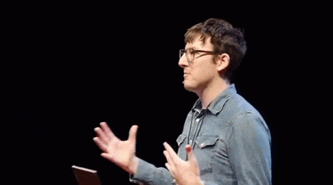

# node-safari

Lets go on a node safari! 🐪 🙈

It's uncertain where this trek will take us, but we will try to strike a balance between instructional material, history, and philosophies on node, javascript, software, programming, engineering, communication, and tooling.

## Required Provisions

* A computer 💻 (hopefully running a flavor of unix)
  * OS X will be easiest to use
  * Linux and windows are a bit more difficult
* Internet and a browser 📞
* some time and interest 🙇

We will be acquiring items and tools along the way.

## Company and Time-line

Getting through all the material is going to take time.  Visit the places that seem most interesting, and don't get stuck on something you find boring or overwhelming.  Programming is [more fun and effective as a hobby](https://twitter.com/substack/status/586438480164589568) and you will learn more if you treat it that way.

Don't go at it alone.  Get in touch with your local javascript and node community and make friends.  Don't live near anyone?

There is a vibrant and active community that is on-line at all hours of the day so you can [remain isolated but still be connected with thousands of people](http://bret.io/2015/05/23/thousand-isolation-d/).

## Getting started.

Before we get started, we need to be somewhat prepared to face what lies ahead.  In order to communicate with the local populous you need to learn how to speak javascript

### [Javascript for Cats](http://jsforcats.com)
If your a cat, like to have fun or learn like a cat, this will teach you the basics of javascript. A+

### [Codecademy](http://www.codecademy.com/en/tracks/javascript)
If you tend to be a bit more serious, Codecademy's Javascript is also a good place to start.  Don't feel bad if you get bored and don't finish.  It's picking up the syntax that counts. B+

## What is javascript?

Javascript is the programming language that your web browser comes with, but these days its becoming a lot more.  Its pretty okay.  Its not the best language and has a lot of warts, but it gets a lot right, and you don't really have a choice about using it or not.  You pretty much have to.

Douglas Crockford gave a good presentation that effectivly answers the question: "What is Javascript?" in his 2012 "Javascript: Your New Overlord" presentation:

[Javascript: Your New Overlord](https://www.youtube.com/watch?v=Trurfqh_6fQ)

## What is node?

Node was created by [Ryan Dahl](http://tinyclouds.org).  He has since pulled a [Mark Pilgrim](http://www.diveintomark.link) and [HTTP 410](http://en.wikipedia.org/wiki/Mark_Pilgrim#.22Disappearance.22_from_the_Internet)'d himself from the INTERNET, but occasionally will post interesting undocumented code projects to his [github](https://github.com/ry).

The best way to understand what node is to listen to Ryan describe it himself.

[Ryan Dahl: Original Node.js presentation](https://www.youtube.com/watch?v=ztspvPYybIY)

[Ryan Dahl Talk - NodeConf Theatre 2012.ogv](https://www.youtube.com/watch?v=GhFrlX0LdFA)

