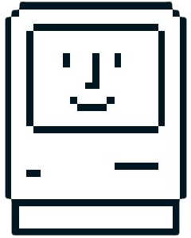

# node-learnbook

Lets learn node the node way! 🐪 🙈


It's uncertain where this trek will take us, but we will try to strike a balance between instructional material, history, and philosophies on node, javascript, software, programming, engineering, communication, and tooling.

We may also cover a few other useful places to learn cool tools and skils like:

- html
- css
- git
- irc
- unix
- app deployment

## Required Provisions

* A computer 💻 (hopefully running a flavor of unix)
  * OS X will be easiest to use
  * Linux and windows are a bit more difficult
* Internet and a browser 📞
* some time and interest 🙇

We will be acquiring items and tools along the way.

## Company and Time-line

Getting through all the material is going to take time.  Visit the places that seem most interesting, and don't get stuck on something you find boring or overwhelming.  Programming is [more fun and effective as a hobby](https://twitter.com/substack/status/586438480164589568) and you will learn more if you treat it that way.

Don't go at it alone.  Get in touch with your local javascript and node community and make friends.  Don't live near anyone?


There is a vibrant and active community that is on-line at all hours of the day so you can [remain isolated but still be connected with thousands of people](http://bret.io/2015/05/23/thousand-isolation-d/).


## Getting started.

Before we get started, we need to be somewhat prepared to face what lies ahead.  In order to communicate with the local populous you need to learn how to speak javascript

### [Javascript for Cats](http://jsforcats.com)
If your a cat, like to have fun or learn like a cat, this will teach you the basics of javascript.


### [nodeschool.io: javascripting](https://github.com/sethvincent/javascripting)

We will revisit [nodeschool.io](http://nodeschool.io/) in the near future, but for now the `javascripting` nodeschool adventure is a good place to start learning javascript.  It may be a bit steep for absolute beginners.  Read through the [`get going`](http://nodeschool.io/#get-going) section to get up and running.

For those who know their way around `npm` already:

```sh
npm install -g javascripting

```


### [Codecademy](http://www.codecademy.com/en/tracks/javascript)
If you tend to be a bit more serious, Codecademy's Javascript is also a good place to start.  Don't feel bad if you get bored and don't finish.  It's picking up the syntax that counts.


## What is javascript?

Javascript is the programming language that your web browser comes with, but these days its becoming a lot more.  Its pretty okay.  Its not the best language and has a lot of warts, but it gets a lot right, and you don't really have a choice about using it or not.  You pretty much have to.

Douglas Crockford gave a good presentation that effectivly answers the question: "What is Javascript?" in his 2012 "Javascript: Your New Overlord" presentation:

[](https://www.youtube.com/watch?v=Trurfqh_6fQ)

[Javascript: Your New Overlord](https://www.youtube.com/watch?v=Trurfqh_6fQ)

## What is node?

Node was created by [Ryan Dahl](http://tinyclouds.org).  He has since pulled a [Mark Pilgrim](http://www.diveintomark.link) and [HTTP 410](http://en.wikipedia.org/wiki/Mark_Pilgrim#.22Disappearance.22_from_the_Internet)'d himself from the INTERNET, but occasionally will post interesting undocumented code projects to his [github](https://github.com/ry) or [post to the node mailing list](https://groups.google.com/forum/#!activity/nodejs/2JvBi5ikhDgJ).

The best way to understand what node is to listen to Ryan describe it himself.

[](https://www.youtube.com/watch?v=ztspvPYybIY)

[Ryan Dahl: Original Node.js presentation](https://www.youtube.com/watch?v=ztspvPYybIY)

[Ryan Dahl: Original Node.js presentation Slide Deck](doc/jsconf.pdf) (pdf)

[](https://www.youtube.com/watch?v=GhFrlX0LdFA)

[Ryan Dahl Talk - NodeConf Theatre 2012.ogv](https://www.youtube.com/watch?v=GhFrlX0LdFA)

[Ryan Dahl Talk NodeConf Theatre 2012 Slides](doc/nodeconf2012.pdf) (pdf)

## How to get node

There are lots of ways to install node.  Lets visit some of the better ways.

### OSX



OSX gets a choice of 3 ways to install node:

#### [Homebrew](http://brew.sh):

Homebrew is a package manager for OS X.  It's written in ruby, and uses git as

#### The installer `node-v*.pkg`

Quick n dirty

#### NVM

Using NVM

### Linux

### Windows

## `node` or `iojs`?

Talk about which one to use quickly.

## How to know node

Now that we have seen a bit about the history and motivations behind node, lets actually start learning more about it.

### [The Art of Node](https://github.com/maxogden/art-of-node#the-art-of-node)

[](https://github.com/maxogden/art-of-node#the-art-of-node)

Written by the prolific [Max Ogden](http://maxogden.com),


the-art-of-node gives a thorough explanation of how node works, how to write node flavored javascript, callbacks and async programming, writing and using modules and how to be apart of the node/js community and do your best.  Its full of insight and clear reasoning, but when you are new to js and/or node, all of the subtleties can fly by pretty quickly.  It's a short and easily digestible read, that you should probably read through a few times.

### [Node.js in Action](http://www.manning.com/cantelon/)

[](http://www.manning.com/cantelon/)

([2nd Edition Coming Soon](http://www.manning.com/cantelon2/))x

Written by a crew of early prolific node.js module developers, this book is totally great and somewhat  flawed, and a bit dated at this point as well.  But for those that learn by example, this is the book for you.

It covers the basics of all the well known [Visionmedia](https://github.com/visionmedia)  modules (e.g. [express](http://expressjs.com), [mocha](http://mochajs.org), [connect](https://github.com/senchalabs/connect#readme), [jade](http://jade-lang.com), [ejs](http://www.embeddedjs.com) etc...).  You will learn to use all of these early node tools, including core node modules, async programming, testing, templating, CLI programs, and even node clustering from this book through the various included projects and examples.

Despite the fact that many of the modules discussed have changed their APIs, this is still a great reference and useful for learning node.

#### What this book does well:

- Introduction to node, events async programming and flow control
- [socket.io](http://socket.io) examples
- Module resolution and loading (a.k.a. [require('foo')](https://nodejs.org/api/modules.html#modules_module_require_id))
- http
- ORMs and Databases
- Middleware and [Connect](https://github.com/senchalabs/connect)
- [Express](http://expressjs.com) photo hosting and microblogging app
- Testing (mostly Mocha)
- EJS and Jade templating
- Node application deployment
- System Calls
- Raw TCP/IP
- CLI Tools

Focus on the first and last 1/3 of the book, and don't sweat the middle 1/3rd.  

### [Nodeschool.io](http://nodeschool.io/): `learnyounode`

To get

```sh
npm i learnyounode -g
```


No, not [learnyouhaskell](http://learnyouahaskell.com/), that lives on a different planet.  

##

## ... [WIP]
